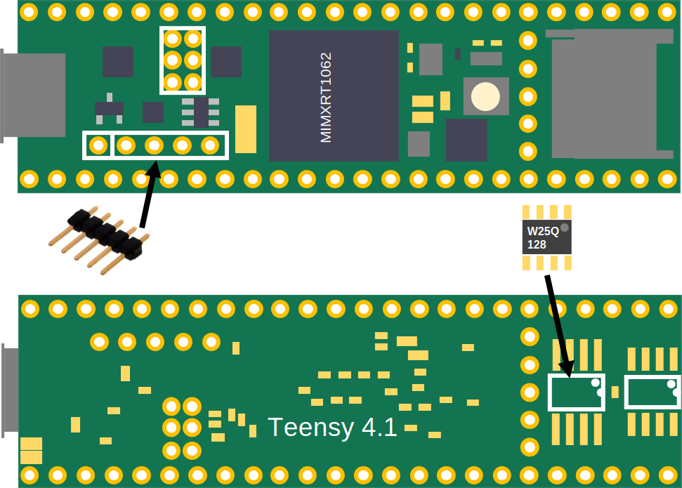
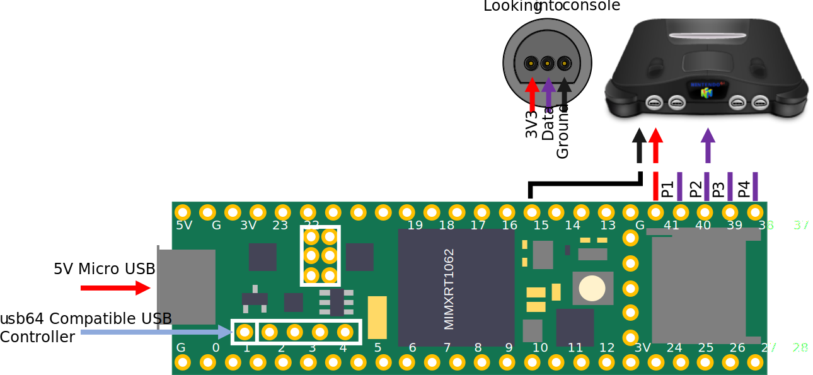
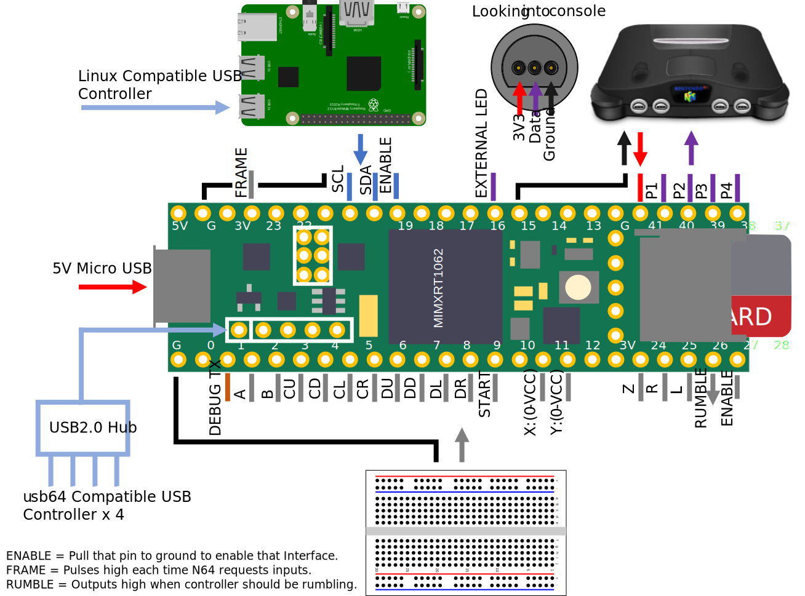

# Hardware Setup
* Install a W25Q126 SPI Flash Chip on the designated footprint.
* Install a 5 x 0.1" pin header on the USB OTG Header.  

# Quick Start
* Program the usb64 as per [compilation instructions](./COMPILE.md).
* Connect a usb64 compatible USB controller.
* Connect the player data lines to the N64 Console.
* Power on the Nintendo 64 console.
* Power on the usb64 (5V via MicroUSB cable).  

# Advanced Usage
* Hardwire a custom N64 controller to the designated IO (Each digital pin is internally pulled-up, Analog input respect to VCC, VCC/2 is central position).
* Hook up a Raspberrty Pi or similar via I2C and send button presses via I2C.  

## License and Attribution
usb64 is shared under the [MIT license](https://github.com/Ryzee119/usb64/blob/dev/LICENSE), however this project includes code by others. Refer to the list below.
* [N64 Console artwork](https://icon-library.net/icon/nintendo-64-icon-23.html) shared under [CC0 Public Domain Licence](https://creativecommons.org/publicdomain/zero/1.0/).
