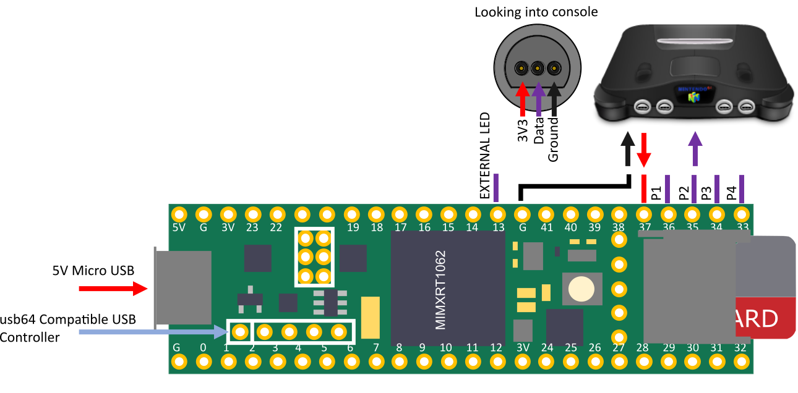
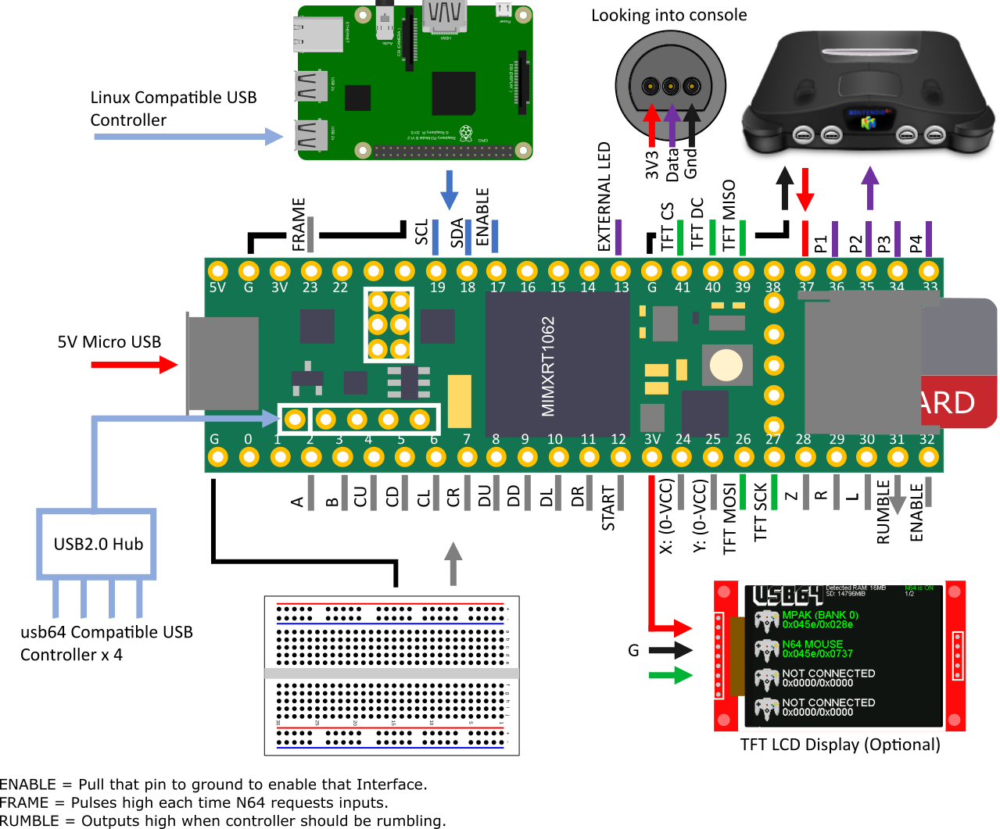

# Hardware Setup
* Install up to two PSRAM chips on the designated footprint. Note one is optional, two is recommended.
* Install a 5 x 0.1" pin header on the USB OTG Header. Note if using the PCB breakout board, the header should go on the underside.  

# Quick Start
* Program the usb64 as per [compilation instructions](./COMPILE.md).
* Connect a usb64 compatible USB controller.
* Connect the player data lines, atleast one ground line and one 3.3V line to/from the N64 Console
* Power on the Nintendo 64 console.
* Power on the usb64 (5V via MicroUSB cable).  

# Breakout PCB
* For a clean finish you can use this breakout PCB to house the Teensy which provide nice labelled solder pads and an embedded USB connector.
* See [Hardware](./hw/README.md) for info.
* Can be ordered [here](https://kitspace.org/boards/github.com/ryzee119/usb64/).

# Advanced Usages
* Use a USB hub to connect up to four usb64 compatible controllers. An externally powered hub may be required.  
* Hardwire a custom N64 controller to the designated IO (Each digital pin is internally pulled-up, Analog input respect to VCC, VCC/2 is central position).
* Hook up a Raspberry Pi or similar via I2C and send button presses via I2C.  

## License and Attribution
usb64 is shared under the [MIT license](https://github.com/Ryzee119/usb64/blob/dev/LICENSE), however this project includes code by others. Refer to the list below.
* [N64 Console artwork](https://icon-library.net/icon/nintendo-64-icon-23.html) shared under [CC0 Public Domain Licence](https://creativecommons.org/publicdomain/zero/1.0/).
