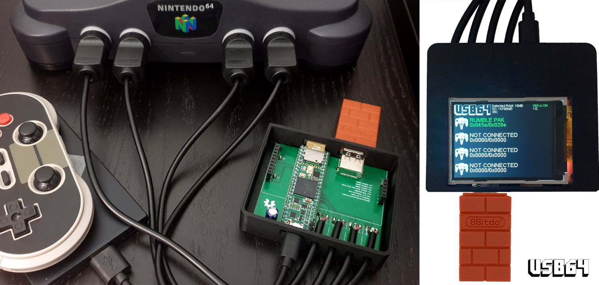

  

   
A project developed to use USB controllers on the Nintendo 64 console.  
Precompiled binaries can be downloaded from [Releases](https://github.com/Ryzee119/usb64/releases).  
**NOTE: This project is still in development, PRs and ideas are welcome. See todo list for ideas.**

- [x] N64 controller emulation (up to four controllers at once!).
- [x] Rumble Pak emulation.
- [x] Controller Pak emulation with four selectable banks. Technically unlimited.
- [x] Transfer Pak emulation. Put Gameboy ROMS on an SD Card!
- [x] N64 mouse emulation. Use a USB Mouse!
- [x] N64 Randnet emulation. Use a USB keyboard!
- [x] Configurable deadzones and sensitivity from the N64 Console.
- [x] True dual analog sticks with GoldenEye and Perfect Dark.
- [x] SD card driver with FATFS support for storage/backup of Gameboy ROMS, controller paks etc.
- [x] A single hardwired controller interface for ultimate hacking.
- [x] Optional TFT LCD Support.

## Todo
- [ ] Raspberry Pi interface or equivalent for all other USB controllers.
- [ ] More inbuilt USB controller drivers. (PS3, Aftermarket Xbox One, OG Xbox, improved Generic HID).
- [ ] USB Bluetooth stack.
- [ ] Mouse/Keyboard input for controllers.
- [ ] Gamecube controller support.
- [ ] Better debug output (Flashing LED, SD card logging)

## Supported Controllers
- Bluetooth 8bitdo/compatible controllers via the [8BitDo Wireless USB Adapter](https://www.8bitdo.com/wireless-usb-adapter/)
- Wired 8bitdo controllers when they are started in X-input mode.
- Xbox S/X Wired
- Xbox one Wired (Genuine / PDP)
- Xbox 360 Wired
- Xbox 360 Wireless (Via PC USB Receiver)
- PS4 Wired
- A hardwired controller, use your own buttons etc.

## Controls
- Back + D-Pad = Insert Controller Pak banks 0 to 3
- Back + LB = Insert Rumblepak
- Back + RB = Insert Transferpak
- Back + Start = Select *virtual pak* (Use in-game Controller Pak managers to configure the device)
- Back + B = Switch to true dual-analog stick more for GoldenEye 007/Perfect Dark
- Back + A = Backup buffered memory to SD Card **(DO THIS BEFORE POWER OFF!)**

## Needed Parts
| Qty | Part Description | Link |
|--|--|--|
| 1 | Teensy 4.1 | https://www.pjrc.com/store/teensy41.html |
| 1 | USB Host Cable | https://www.pjrc.com/store/cable_usb_host_t36.html |
| 3 | 0.1" Pin Header | https://www.pjrc.com/store/header_24x1.html |
| 2 | 64Mbit PSRAM  SOIC-8 | https://www.pjrc.com/store/psram.html |
| 4 | N64 Controller Extensions | [AliExpress](https://www.aliexpress.com/wholesale?catId=0&SearchText=n64%20controller%20extension) |
| 1 | (Optional) ILI9341 TFT LCD Display 2.2" (320x240) | [AliExpress](https://www.aliexpress.com/wholesale?catId=0&SearchText=ili9341%20tft) |
| 1 | MicroSD Card | - |
| 1 | (Optional) Case | https://a360.co/2HPz0U0 |
| 1 | (Optional) PCB breakout board | [Kitspace](https://kitspace.org/boards/github.com/ryzee119/usb64/) |

Note: PSRAM model numbers are IPS6404L-SQ-SPN or ESP-PSRAM64H.

## Compile and Program
See [COMPILE.md](./COMPILE.md).

## Install
See [INSTALL.md](./INSTALL.md).

## How to Use
See [USAGE.md](./USAGE.md).

## License and Attribution
usb64 is shared under the [MIT license](https://github.com/Ryzee119/usb64/blob/dev/LICENSE), however this project includes code by others. Refer to the list below.
* [mpaland](https://github.com/mpaland)/**[printf](https://github.com/mpaland/printf)** shared under the [MIT License](https://github.com/mpaland/printf/blob/master/LICENSE).
* [USBHost_t36 fork](https://github.com/Ryzee119/USBHost_t36) shared under an '[MIT or MIT-like license](https://forum.pjrc.com/threads/29382-open-source-license-issues-when-using-teensy-products?p=79667&viewfull=1#post79667)'.
* [Teensy cores](https://github.com/PaulStoffregen/cores) shared under an '[MIT or MIT-like license](https://forum.pjrc.com/threads/29382-open-source-license-issues-when-using-teensy-products?p=79667&viewfull=1#post79667)'.
* [MBC emulation code](src/n64/n64_transferpak_gbcarts.c) is adapted from [Peanut-GB](https://github.com/deltabeard/Peanut-GB) shared under an MIT License.

usb64 with optional case and TFT display.

If you like my work please consider a small donation 
 
