# Usage
* [Controller Paks](#controller-paks)
* [Rumble Paks](#rumble-paks)
* [Transfer Paks](#transfer-paks)
* [Virtual Pak](#virtual-pak)
* [Dual Stick Mode](#dual-stick-mode)
* [N64 Mouse](#n64-mouse)
* [TFT LCD Display](#tft-lcd-display)
* [Debug](#debug)

## Controller Paks
* usb64 can simulate four Mempaks simultaneously. To select a Mempak press `BACK+D-PAD` direction to select the respective bank.
* Two controllers cannot have the same bank selected. The second controller will revert to a Rumblepak.
* Do not unplug the usb64's power before turning off the n64 console to prevent data loss. The usb64 senses the n64 console turning off and flushes data to the SD Card.
* Inserting the SD card into your PC will show Mempaks as `MEMPAKXX.MPK` where XX is the bank number. You can back these up to your PC.

## Rumble Paks
* usb64 can simulate four Rumblepaks simultaneously. Rumblepaks are the default peripheral on power up. To select a Rumblepak press `BACK+LB`.
* The usb controller must support force feedback.

## Transfer Paks
* usb64 can simulate four transferpaks simulateneously. The select a Transferpak press `BACK+RB`. The transferpak will attempt to load the previously set Gameboy or Gameboy Colour ROM from the SD Card.
* To select the ROM to load, you must first use the [*VirtualPak*](#virtualpak). If a ROM isn't selected, or fails to load, it will revert to a Rumblepak.
* Avoid having two controllers access the same ROM at once.
* Do not unplug the usb64's power before turning off the n64 console to prevent data loss. The usb64 senses the n64 console turning off and flushes data to the SD Card.
* Gameboy saves can be copied over to the SD Card for use with the Transferpak. The file name must match the ROM save with a `.SAV` extension.
* You can simulate four transferpaks, with four difference ROMS, with four different save files! 
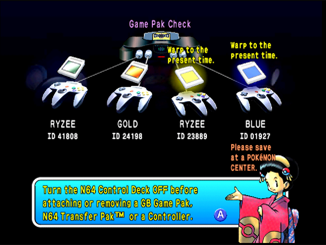  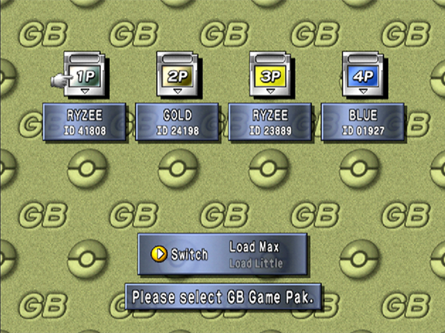
 
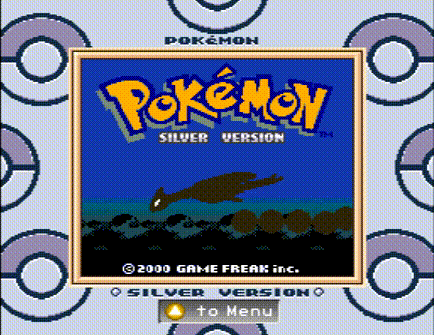  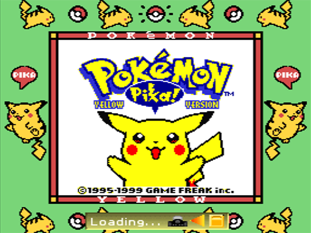
 
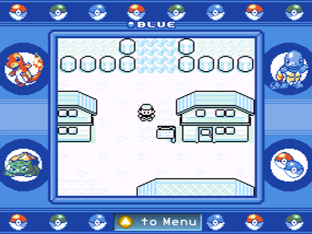  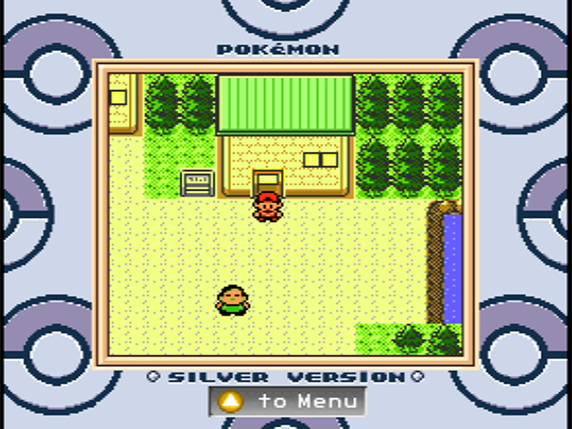
 

## Virtual Pak
* The VirtualCpak is one of my favourite features. It's like a Controller Pak, but is not used for save files. It exploits the Mempak managers built into some N64 games to configure the usb64 device!
* To select the Virtualpak press `BACK+START`.
* To use the Virtualpak, boot into a game that has a Contrroller Pak manager. Some games will work better than others. `Army Men: Air Combat` is a good one. `Perfect Dark` works well too. Hold START whilst the game is booting to access the Controller Pak manager. The follow screens show `Army Men: Air Combat` and `Perfect Dark` as an example. 
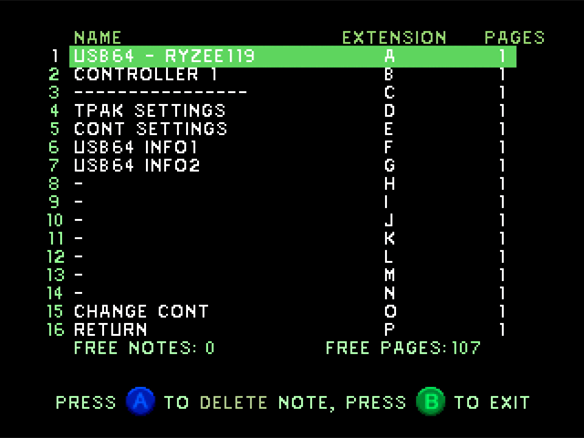  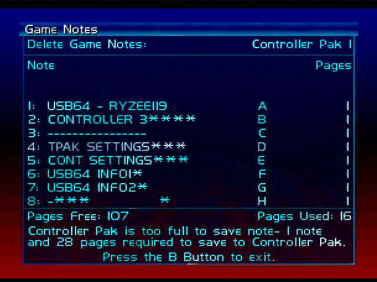

* To select an item, you actually delete that note from the Controller Pak. usb64 detects what row you selected as if navigating a menu!
* **TPAK SETTINGS** is used to configure what ROM to load into the Transferpak. This will scan the SD card for files with `.gb` and `.gbc` extensions. A `*` will print next to the currently set ROM. You can have up to ten ROMs on the SD card. After this they will just get ignored. 
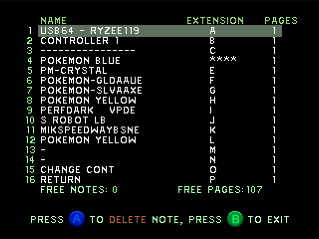

* **CONT SETTINGS** is used to configure the controller. You can change deadzone, Sensitivity, toggle on/off snapping to 45deg angles and toggle on/off a octagonal N64 stick correction. The set values is shown as a number next to the row. Each controller can be configured individually. Note: Some controllers will have deadzones or 45 degree angle snapping built in. For these, usb64 can't disable it. 
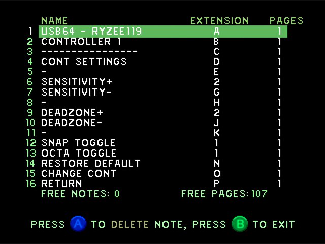

* **USB64 INFO1** shows what controller is connected to that port. 
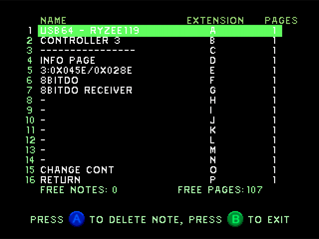

* **USB64 INFO2** is currently a placeholder.

## Dual Stick Mode
* Dual stick mode exploits a feature present in Perfect Dark and GoldenEye 007 to use two controllers at once for true dual analog stick input.
* To use, the usb64 must be connected to controller port one and two as a minimum. It works by simulating two controllers with one and injecting the 2nd analog stick into port two. If a 2nd controller is connected to the usb64 when using this mode, it will get pushed to slot three.
* To enable press `BACK+B`.
* Set the game controller input for dual stick mode. It has been designed to work best with `Layout 2.4`. 
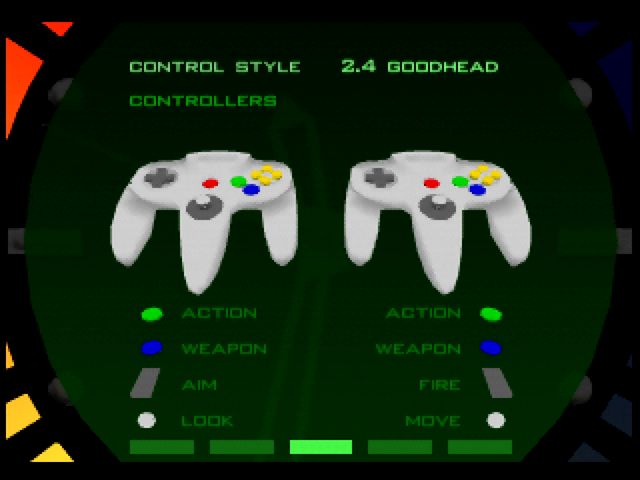  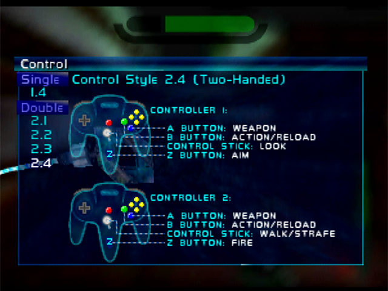

## N64 Mouse
* usb64 can simulate four N64 Mouse peripherals simulateneously!
* Just plug in a USB mouse and the usb64 will auto detect it and emulate a N64 Mouse.
* The middle mouse button is mapped to START. 
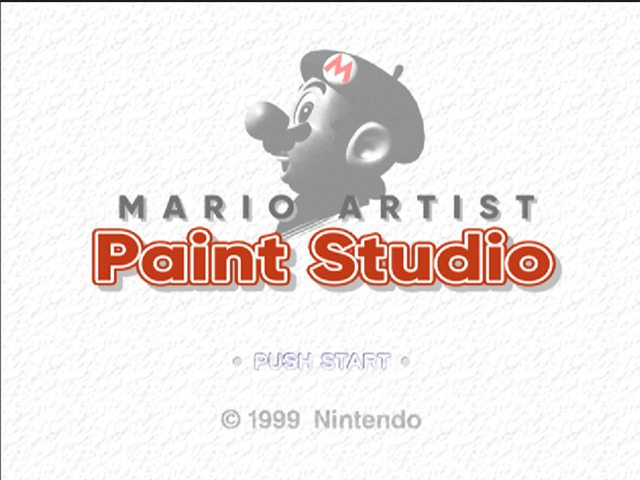 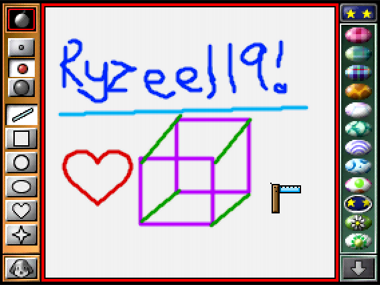

## TFT LCD Display
* usb64 supports an optional TFT LCD display based on the low cost and extremely common ILI9341 display controller.
* The display will automatically work once connected.
* To cycle through different screens press `L+R`. Currently the default screen shows an overview of the current controller status. The other screen shows some useful debug info. 
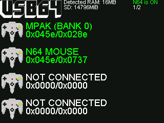 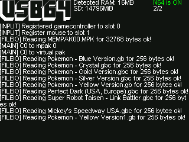

## Debug
* There's alot going, and currently it may not be clear what the usb64 is doing. Until something better is implemented, you can connect the usb64 to your PC via a MicroUSB cable. This will enumerate as a serial comport. Connect to it with your favourite terminal to get some feedback. The code can be recompiled with [additional debug flags](./src/usb64_conf.h). 
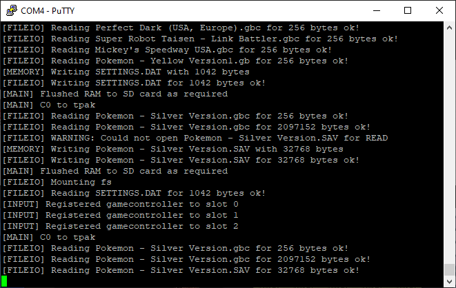

